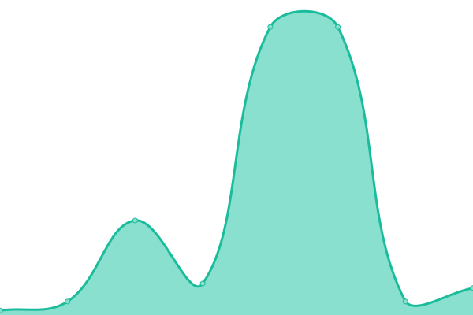
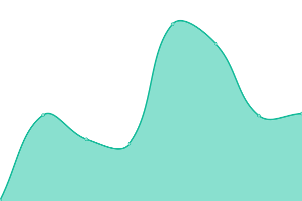

# [📈 Live Status](https://status.globed.dev): <!--live status--> **🟩 All systems operational**

This repository contains the open-source uptime monitor and status page for [Globed](https://globed.dev), powered by [Upptime](https://github.com/upptime/upptime).

With [Upptime](https://upptime.js.org), you can get your own unlimited and free uptime monitor and status page, powered entirely by a GitHub repository. We use [Issues](https://github.com/GlobedGD/upptime/issues) as incident reports, [Actions](https://github.com/GlobedGD/upptime/actions) as uptime monitors, and [Pages](https://status.globed.dev) for the status page.

<!--start: status pages-->
<!-- This summary is generated by Upptime (https://github.com/upptime/upptime) -->
<!-- Do not edit this manually, your changes will be overwritten -->
<!-- prettier-ignore -->
| URL | Status | History | Response Time | Uptime |
| --- | ------ | ------- | ------------- | ------ |
|  [Central server](https://main.globed.dev/servers?protocol=65535) | 🟩 Up | [central-server.yml](https://github.com/GlobedGD/upptime/commits/HEAD/history/central-server.yml) | 

 528ms
     
 | 

<a href="https://status.globed.dev/history/central-server">100.00%</a>
    

|  [Server 1 (EU)](ds1.mathieuar.fr) | 🟩 Up | [server-1-eu.yml](https://github.com/GlobedGD/upptime/commits/HEAD/history/server-1-eu.yml) | 

 118ms
     
 | 

<a href="https://status.globed.dev/history/server-1-eu">100.00%</a>
    

|  [Server 2 (US East)](vps1.mathieuar.fr) | 🟩 Up | [server-2-us-east.yml](https://github.com/GlobedGD/upptime/commits/HEAD/history/server-2-us-east.yml) | 

 27ms
     
 | 

<a href="https://status.globed.dev/history/server-2-us-east">100.00%</a>
    

|  [Server 3 (SEA)](vps2.mathieuar.fr) | 🟩 Up | [server-3-sea.yml](https://github.com/GlobedGD/upptime/commits/HEAD/history/server-3-sea.yml) | 

 209ms
     
 | 

<a href="https://status.globed.dev/history/server-3-sea">100.00%</a>
    

|  [Relay (RU)](globed-proxy.cgyt.ru) | 🟩 Up | [relay-ru.yml](https://github.com/GlobedGD/upptime/commits/HEAD/history/relay-ru.yml) | 

 142ms
     
 | 

<a href="https://status.globed.dev/history/relay-ru">100.00%</a>
    

|  [Main Argon](https://argon.globed.dev/v1/status?errorifdead=1) | 🟩 Up | [main-argon.yml](https://github.com/GlobedGD/upptime/commits/HEAD/history/main-argon.yml) | 

 487ms
     
 | 

<a href="https://status.globed.dev/history/main-argon">100.00%</a>
    

|  [Website](https://globed.dev) | 🟩 Up | [website.yml](https://github.com/GlobedGD/upptime/commits/HEAD/history/website.yml) | 

 187ms
     
 | 

<a href="https://status.globed.dev/history/website">100.00%</a>
    

|  [Credits server](https://credits.globed.dev/credits) | 🟩 Up | [credits-server.yml](https://github.com/GlobedGD/upptime/commits/HEAD/history/credits-server.yml) | 

 496ms
     
 | 

<a href="https://status.globed.dev/history/credits-server">100.00%</a>
    

<!--end: status pages-->

[**Visit our status website →**](https://status.globed.dev)

## 📄 License

- Powered by: [Upptime](https://github.com/upptime/upptime)
- Code: [MIT](./LICENSE) © [Anand Chowdhary](https://anandchowdhary.com), supported by [Pabio](https://pabio.com)
- Data in the `./history` directory: [Open Database License](https://opendatacommons.org/licenses/odbl/1-0/)
